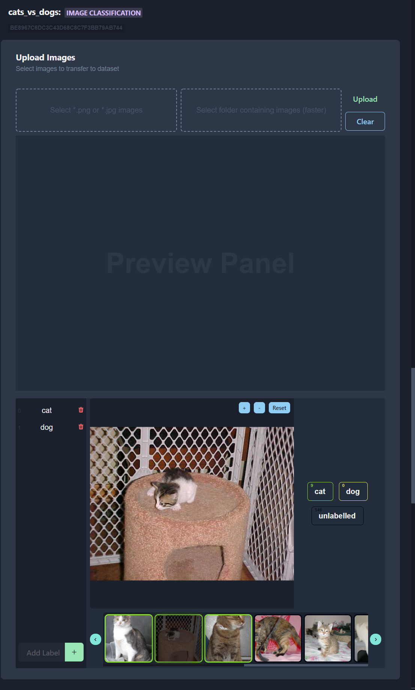
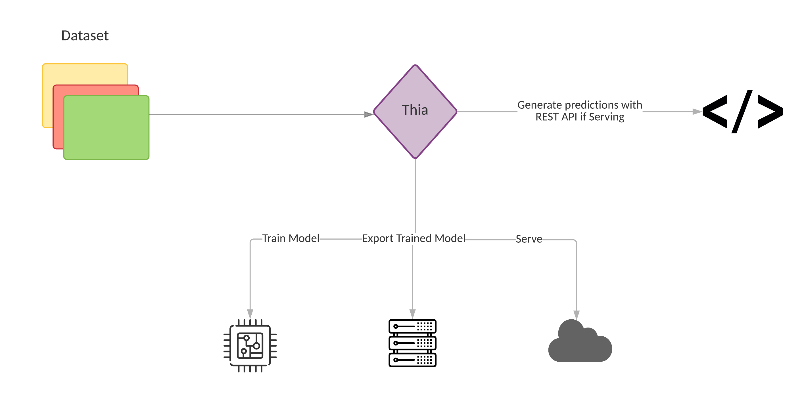
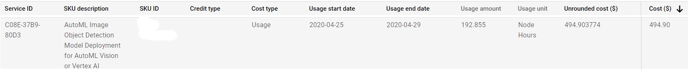

<h1 align=center>Thia Auto-ML</h1>

 

 

An Auto-ML application that runs on your **OWN** computer instead of some server in the cloud.

 
 
 

Thia will be the hub to train, serve, and monitor your ML models. Our ML Engine runs on **YOUR** computer _(and of your remote linux machines in the future)_ so **YOU** are in control of your own private data. The only time the app communicates with our servers will be for [Authn and Authz](https://www.cloudflare.com/en-ca/learning/access-management/authn-vs-authz/ 'Learn about the difference'), everything else will be packaged in the installer.

## Pricing

Free while we are still in Pre-Alpha/Alpha. When we are in Beta and onwards, expect a tiered payment model. **However**, since this is running on your hardware, our pricing will be **drastically** lower than other cloud auto-ml providers _(see an example near the end)_.

## Brief Roadmap

#### Alpha (MVP)

For the MVP we need to be able to:

1. Create a dataset
2. Train an Image classification model
3. Export the model in format of choice.

##### <u>Tasks to be completed</u>

✅ UI & Architecture
 
✅ App & Engine Packaging
 
✅ Image Classification Dataset
 
❌ Image Classification Model Training _(eta March 2022)_
 
❌ Image Classification Model Export _(eta April 2022)_
 

#### Beta

For the beta release we need to be able to:

1. Train models on a remote Ubuntu VM
2. Export models for serving to a remote Ubuntu VM
3. Train an Object Detection model

##### <u>Tasks to be completed</u>

❌ Get Funding
 
❌ Expand Team
 
❌ App Signing
 
❌ UI Rework
 
❌ Remote VM Management
 
❌ Object Detection Model Training
 
❌ Highly Optimized Model Exporting via TensorRT
 
❌ Website & APIs Up
 
❌ Authn & Authz

## About

Currently Thia is a passion project of mine (hoping to get some funding after the MVP is done) that I came up with after I received an absolutely ridiculous bill from Google Cloud:

This was for a hackathon I partaking in where I needed a model to detect individual roofs of houses from satellite images. The training was done twice and took about half a day each with 8 nodes in parallel. This is where cloud auto-ml providers get you; training is never quick, and you can kiss your wallet goodbye if you need to retrain when you get more data.

Commercial GPUs now are so powerful and so common (thanks to crypto and games) that almost everyone has access to a GPU and if they don't they can rent a relatively cheap machine that does have one from the [multitude of providers](https://geekflare.com/best-cloud-gpu-platforms/ 'List of some GPU providers ') out there. So why are there no auto-ml solutions that can run on your own hardware? _(sarcasm)_.

## Contributing

While I'm not actively looking for any help on this project yet, I will have to soon. If you or anyone you know would be interested in joining, [get in touch](https://www.linkedin.com/in/ritesh-ahlawat/ 'My LinkedIn') with me :D.
